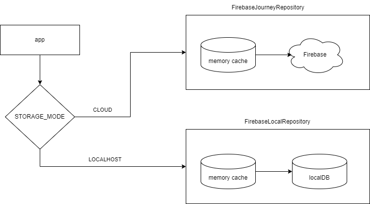

# Car Pooling Service Challenge

Design/implement a system to manage car pooling.

At Cabify we provide the service of taking people from point A to point B.
So far we have done it without sharing cars with multiple groups of people.
This is an opportunity to optimize the use of resources by introducing car
pooling.

You have been assigned to build the car availability service that will be used
to track the available seats in cars.

Cars have a different amount of seats available, they can accommodate groups of
up to 4, 5 or 6 people.

People requests cars in groups of 1 to 6. People in the same group want to ride
on the same car. You can take any group at any car that has enough empty seats
for them. If it's not possible to accommodate them, they're willing to wait until
there's a car available for them. Once a car is available for a group
that is waiting, they should ride.

Once they get a car assigned, they will journey until the drop off, you cannot
ask them to take another car (i.e. you cannot swap them to another car to
make space for another group).

In terms of fairness of trip order: groups should be served as fast as possible,
but the arrival order should be kept when possible.
If group B arrives later than group A, it can only be served before group A
if no car can serve group A.

For example: a group of 6 is waiting for a car and there are 4 empty seats at
a car for 6; if a group of 2 requests a car you may take them in the car.
This may mean that the group of 6 waits a long time,
possibly until they become frustrated and leave.

## How to Run It

### Prerequisites

Before running the application, make sure you have the following installed:

- [Node.js](https://nodejs.org/) (version 20.17.0 or later)
- [npm](https://www.npmjs.com/)

### Installation

1. Clone the repository:

```bash
   git clone git@gitlab-hiring.cabify.tech:cabify-challenge/car-pooling-challenge-candidate-Dc1YWM0NTF.git
   cd car-pooling-challenge-candidate-Dc1YWM0NTF
```

2. Install dependencies

```node
  npm install
```

3. Set up environment

For the purposes of the challenge, the relevant information to be able to connect to Firebase is in the .env file so it is not necessary to do anything.
In a real environment, this file would not only not be uploaded, but we would have to supply this need with a secrets service such as Google or AWS Secrets Manager.

The only practical consideration is to configure the app to run in a cloud or local environment. This can be done by changing the flag

```node
   STORAGE_MODE=localhost | cloud
```

Por defecto se encuentra en localhost.

4. Run the application

```node
   npm run start
```

## Tests

The application has both unit and integration tests for those flows considered core. To run them, you must execute the command

```node
   npm run test
```

## Implement Decisions

### Considerations

**Synchronism vs Asynchronism**

It is assumed that in this application we will perform the assignment *synchronously* to the client requests. This means that we will return a response once we have performed the corresponding operations in the database. In a real case, the correct way to perform the operations can be with a synchronously cache and a cache consistency mechanism with the database. Up to this point, we are still talking about synchronization. But a higher level of correctness would be asynchronous processing, where the server is responsible for creating trips and informing both the group and the car of this event.

**Database**

I thought it was appropriate to propose both a cloud-based approach and a local approach to the challenge. Both are functional, except that the limitation of the cloud approach is the response time and the cost. Currently, Firebase has a usage quota that, with a load of tests, can be quite expensive.
Both approaches have an in-memory cache storage to speed up operations. It should be noted that due to time constraints, the cloud approach was prioritized, which is why localDB is not implemented.Consider to the scope of the challenge, it is important to have a cloud information repository to avoid recruiters having to install a local db or deal with configurations, docker images, etc. For this reason, I chose to use Firebase with Google Authentication and generate three collections: cars, journeys and group. All necessary environment data to run the application is located on .env file. This implementation is not correct in a real environment, the correct thing would be to use some secrets service, but given the scope of the challenge I considered that it was the most practical way. Aditionally, an interface was used to allow another repository to be easily implemented if required




**Cache**

The best way to perform the application with at least $`10^4`$ / $`10^5`$ cars / waiting groups is using a cache. The most expensive operation in this type of services is the interaction with the database. That is why I have used a very simple cache implementation to try to reflect the benefits of its use for practical purposes. This cache maintains consistency with the database and avoids having to consult it every time we want to process it. For practical purposes, we keep the available cars and groups that are not traveling ordered as we want to process them.

**What kind of cache/cache service we use and we could use?**

For the purposes of the challenge, the cache is implemented in a very simple way, allowing data to be stored in memory with an object. If we move this to production, Redis or Memcached could become a scalable solution.

**Error messaging and Logs**

I consider this point to be no less important, since many times the backend offers sensitive information to any attacker, such as "I can't answer you because you're using the header wrong, use it this way." In this sense, messages to the client are encapsulated in a 400 error indicating that the validation went wrong, but in the logs indicating what went wrong. In this way, at the troubleshooting level, we would have the information to know what is happening, but not for a possible attacker.

## Evaluation rules

This challenge has a partially automated scoring system. This means that before
it is seen by the evaluators, it needs to pass a series of automated checks
and scoring.

### Checks

All checks need to pass in order for the challenge to be reviewed.

- The `acceptance` test step in the `.gitlab-ci.yml` must pass in master before you
  submit your solution. We will not accept any solutions that do not pass or omit
  this step. This is a public check that can be used to assert that other tests
  will run successfully on your solution. **This step needs to run without
  modification**
- _"further tests"_ will be used to prove that the solution works correctly.
  These are not visible to you as a candidate and will be run once you submit
  the solution

### Scoring

There is a number of scoring systems being run on your solution after it is
submitted. It is ok if these do not pass, but they add information for the
reviewers.

## API

To simplify the challenge and remove language restrictions, this service must
provide a REST API which will be used to interact with it.

This API must comply with the following contract:

### GET /status

Indicate the service has started up correctly and is ready to accept requests.

Responses:

- **200 OK** When the service is ready to receive requests.

### POST /init

Generate a random group of cars and groups and store into the database.

**Body** _required_ The list of cars to load.

Sample:

```json
{
    "car_amount": 30,
    "group_amount": 10
}
```

Responses:

* **200 OK** When data was generate and stored successfully.
* **500 Bad Request** When there is a failure in the request format, expected
  headers, or the payload can't be unmarshalled.

### POST /process_journey

Start manually the process of associate car with a group and store the result into database

Responses:

- **200 OK** When the process was finished successfully
- **500 Bad Request** When there is a failure in the request format, expected
  headers, or the payload can't be unmarshalled.

### PUT /cars

Load the list of available cars in the service and remove all previous data
(reset the application state). This method may be called more than once during
the life cycle of the service.

**Body** _required_ The list of cars to load.

**Content Type** `application/json`

Sample:

```json
[
  {
    "id": 1,
    "seats": 4
  },
  {
    "id": 2,
    "seats": 6
  }
]
```

Responses:

* **200 OK** When the list is registered correctly.
* **400 Bad Request** When there is a failure in the request format, expected
  headers, or the payload can't be unmarshalled.

### POST /journey

A group of people requests to perform a journey.

**Body** _required_ The group of people that wants to perform the journey

**Content Type** `application/json`

Sample:

```json
{
  "id": 1,
  "people": 4
}
```

Responses:

* **200 OK** or **202 Accepted** When the group is registered correctly
* **400 Bad Request** When there is a failure in the request format or the
  payload can't be unmarshalled.

### POST /dropoff

A group of people requests to be dropped off. Whether they traveled or not.

**Body** _required_ A form with the group ID, such that `ID=X`

**Content Type** `application/x-www-form-urlencoded`

Responses:

* **200 OK** or **204 No Content** When the group is unregistered correctly.
* **404 Not Found** When the group is not to be found.
* **400 Bad Request** When there is a failure in the request format or the
  payload can't be unmarshalled.

### POST /locate

Given a group ID such that `ID=X`, return the car the group is traveling
with, or no car if they are still waiting to be served.

**Body** _required_ A url encoded form with the group ID such that `ID=X`

**Content Type** `application/x-www-form-urlencoded`

**Accept** `application/json`

Responses:

* **200 OK** With the car as the payload when the group is assigned to a car. See below for the expected car representation

```json
  {
    "id": 1,
    "seats": 4
  }
```

* **204 No Content** When the group is waiting to be assigned to a car.
* **404 Not Found** When the group is not to be found.
* **400 Bad Request** When there is a failure in the request format or the
  payload can't be unmarshalled.

## Tooling

At Cabify, we use Gitlab and Gitlab CI for our backend development work.
In this repo you may find a [.gitlab-ci.yml](./.gitlab-ci.yml) file which
contains some tooling that would simplify the setup and testing of the
deliverable. This testing can be enabled by simply uncommenting the final
acceptance stage. Note that the image build should be reproducible within
the CI environment.

Additionally, you will find a basic Dockerfile which you could use a
baseline, be sure to modify it as much as needed, but keep the exposed port
as is to simplify the testing.

:warning: Avoid dependencies and tools that would require changes to the
`acceptance` step of [.gitlab-ci.yml](./.gitlab-ci.yml), such as
`docker-compose`

:warning: The challenge needs to be self-contained so we can evaluate it.
If the language you are using has limitations that block you from solving this
challenge without using a database, please document your reasoning in the
readme and use an embedded one such as sqlite.

You are free to use whatever programming language you deem is best to solve the
problem but please bear in mind we want to see your best!

You can ignore the Gitlab warning "Cabify Challenge has exceeded its pipeline
minutes quota," it will not affect your test or the ability to run pipelines on
Gitlab.

## Requirements

- The service should be as efficient as possible.
  It should be able to work reasonably well with at least $`10^4`$ / $`10^5`$ cars / waiting groups.
  Explain how you did achieve this requirement.
- You are free to modify the repository as much as necessary to include or remove
  dependencies, subject to tooling limitations above.
- Document your decisions using MRs or in this very README adding sections to it,
  the same way you would be generating documentation for any other deliverable.
  We want to see how you operate in a quasi real work environment.

## Feedback

In Cabify, we really appreciate your interest and your time. We are highly
interested on improving our Challenge and the way we evaluate our candidates.
Hence, we would like to beg five more minutes of your time to fill the
following survey:

- https://forms.gle/EzPeURspTCLG1q9T7
  ✅ _Form answered as emanuelmosegue@gmail.com_

Your participation is really important. Thanks for your contribution!
